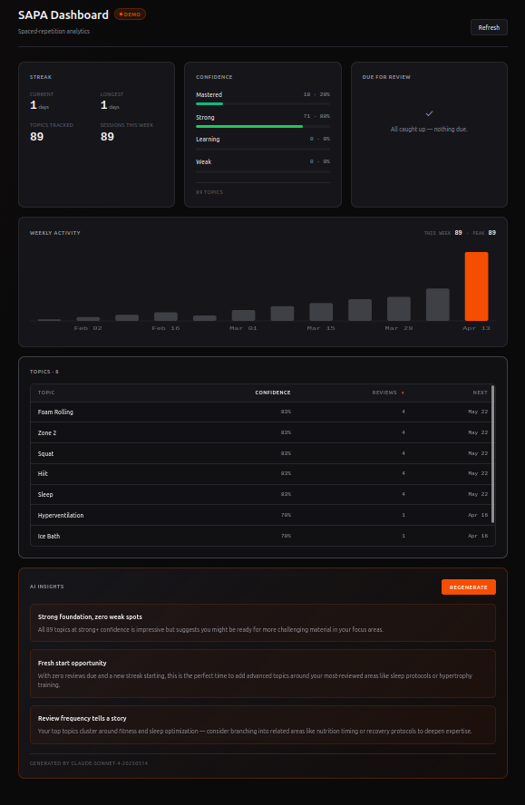

# SAPA Dashboard

**Live demo:** https://sapa-dashboard.vercel.app



A real-time analytics dashboard for [SAPA](https://github.com/wsantas/sapa-public), a local FastAPI spaced-repetition tracker. Built as a 0→1 TypeScript + React learning project against a real backend I already owned.

> The Vercel deployment runs in demo mode with a baked snapshot of real SAPA analytics and a real Claude-generated insights response — the frontend code path is identical, just short-circuited before the network call so there's no need to expose a local backend. Clone the repo and run it against your own SAPA instance (see below) to see it hit the live API.

The point was to build a production-quality TS + React frontend in a few focused sessions, hitting every major pattern Ashby-class and PostHog-class codebases care about, while shipping something I actually use.

## What it does

- Pulls a rich analytics payload from SAPA's `/api/analytics` endpoint and renders it as **six dashboard widgets**: streak stats, confidence distribution, due-reviews list, weekly activity chart (hand-rolled SVG), sortable topics explorer, and an AI insights card
- Validates every network response at runtime with Zod so shape drift surfaces as a readable error immediately rather than crashing three renders later
- Surfaces a custom **AI Insights** widget that POSTs the current learning state to `/api/ai/insights` on the backend, which in turn calls Claude Sonnet 4.5 with a coaching system prompt and returns 2–3 personalized, actionable suggestions
- Handles loading, error, and retry states cleanly across every async surface, powered by a single generic `useAsyncData<T>` hook and a discriminated-union `AsyncState<T>` type
- Covered by **21 passing tests**: 7 Zod schema assertions on typed-as-`unknown` fixtures, and 14 React Testing Library component tests using accessible role-based queries

## Stack

| Layer | Choice | Why |
|---|---|---|
| Bundler | Vite 8 | Fast, ESM-native, Vitest reuses the same transform |
| Runtime | React 19 | Latest stable, auto JSX transform, automatic batching |
| Language | TypeScript in `strict` + `noUncheckedIndexedAccess` + `exactOptionalPropertyTypes` + `verbatimModuleSyntax` | Senior-grade strictness from day one, not bolted on later |
| Runtime validation | Zod v4 with `z.infer` for type derivation | Single source of truth: schemas drive types |
| Data fetching | Hand-rolled generic `apiGet<T>` / `apiPost<T>` with schema-constrained generics | No React Query until the use case justifies it (YAGNI) |
| Styling | CSS Modules + CSS custom properties | Scoped, type-friendly, zero runtime cost |
| Charts | Hand-rolled SVG (no Recharts, no D3) | The whole chart is ~100 lines; a charting library would cost ~90KB for one visualization |
| Tests | Vitest + jsdom + React Testing Library + user-event | Schema tests + behavior-based component tests in one toolchain |
| Deployment | Vercel (free tier) with `VITE_DEMO_MODE=true` | Hosted demo without exposing the local backend |
| Backend | [SAPA](https://github.com/wsantas/sapa-public) — FastAPI, SQLite, watchdog, Anthropic Python SDK | Already built; this project talks to it |

## Architecture in one diagram

```
┌────────────────────────────┐         ┌──────────────────────────┐
│   sapa-dashboard (this)    │         │  sapa-public (FastAPI)   │
│                            │         │                          │
│   App.tsx                  │         │   /api/analytics         │
│   └─ useAsyncData<T>       │◀──────▶ │   /api/topics            │
│      └─ apiGet<T>          │  HTTP   │   /api/ai/insights ──────┼──▶ Claude
│         └─ zod parse       │         │                          │
│                            │         │   SQLite + watchdog       │
│   ┌──────────────────────┐ │         │   spaced-repetition core  │
│   │ StreakCard           │ │         │                          │
│   │ ConfidenceBreakdown  │ │         └──────────────────────────┘
│   │ DueReviewsList       │ │
│   │ WeeklyActivityChart  │ │
│   │ TopicsExplorer       │ │
│   │ InsightsCard ────────┼─┘
│   └──────────────────────┘
└────────────────────────────┘
```

## TypeScript patterns worth reading

If you're evaluating this code, these are the bits I'd point at first:

- **Discriminated union for async state** (`src/types.ts` + `src/useAsyncData.ts`) — `AsyncState<T>` is a four-variant union with a `status` discriminant. Every switch in `App.tsx` and `InsightsCard.tsx` uses exhaustiveness checking via `const _exhaustive: never = state` in the default branch. Adding a fifth variant would cause a compile error at every incomplete switch.
- **Schema-first types** (`src/types.ts`) — `z.infer<typeof AnalyticsSchema>` derives the TS type from the zod schema. There is no way to drift the type and the validator. Rename a field, everything updates.
- **Generic typed API client** (`src/api.ts`) — `apiGet<T>(path, schema: z.ZodType<T>)` uses `z.ZodType<T>` as the constraint so a call site like `apiGet('/api/analytics', AnalyticsSchema)` infers `Promise<Analytics>` with zero explicit type arguments. Same for `apiPost<T>`. Adding a new endpoint is one line — see `fetchTopics()`.
- **Generic custom hook** (`src/useAsyncData.ts`) — `useAsyncData<T>(fetcher: () => Promise<T>)` returns `{ state: AsyncState<T>, refetch }`. `refetch` is memoized with `useCallback([])`, uses a `version` counter and a cancellation flag to prevent stale state updates on unmount or race. Sets loading state in the event handler rather than inside the effect to avoid the `react-hooks/set-state-in-effect` smell.
- **Zod at the boundary, cast-free** (`src/api.ts`) — every network response goes through `schema.safeParse()` with `z.prettifyError()` error messages. No `as T` casts. Runtime-invalid responses surface as readable errors in the UI's error state.
- **Typed column config for sortable tables** (`src/components/TopicsExplorer.tsx`) — `SortKey` is a discriminated string-literal union, `Column` is a readonly record with per-column `format(topic)` functions, and `compareTopics()` dispatches on runtime value type (numeric subtraction for numbers, `localeCompare` for strings — which happens to be the right sort for ISO 8601 date strings too). Adding a column is one record; typos are caught at compile time.
- **Hand-rolled typed SVG chart** (`src/components/WeeklyActivityChart.tsx`) — pure TS + SVG with a `viewBox` for responsive scaling, `<title>` elements per bar for free hover tooltips and screen-reader access, and module-level constants for layout math. No charting library dependency.
- **`Record<keyof T, V>` label maps** (`src/components/ConfidenceBreakdown.tsx`) — links UI labels to schema keys at compile time. Add a new confidence bucket and TS forces you to add its label.
- **`readonly T[]` prop contracts** (`src/components/DueReviewsList.tsx`, `TopicsExplorer.tsx`, `WeeklyActivityChart.tsx`) — widgets can't mutate their inputs. TS strips `push`/`sort`/etc. at the type level.
- **Module-scope `Intl.DateTimeFormat`** (`src/components/DueReviewsList.tsx`, `TopicsExplorer.tsx`) — expensive locale-aware formatters created once, not on every render.
- **Behavior-based component tests** (`src/components/*.test.tsx`) — every RTL test queries by accessible role (`getByRole('button', { name: /generate/i })`) rather than by `data-testid` or CSS class, so tests constrain behavior, not structure. Refactors that don't change user-visible behavior leave them passing.
- **Import-after-mock for ESM-safe mocking** (`src/components/InsightsCard.test.tsx`) — uses `vi.mock('../api', …)` followed by `const { InsightsCard } = await import('./InsightsCard')` so the component binds to the mock, not the real module. Subtle but important: a normal top-level `import` would resolve before the mock is registered.

## Running locally

You'll need SAPA running on port 8002 (see [sapa-public](https://github.com/wsantas/sapa-public) — CORS is pre-configured for `localhost:5173`).

```bash
# Start SAPA backend in one terminal
cd ~/dev/sapa-public
PYTHONPATH=. .venv/bin/python -m sapa.app --port 8002

# Start the dashboard in another
cd ~/dev/sapa-dashboard
npm install
npm run dev
```

Open http://localhost:5173.

For the AI Insights widget, SAPA needs a valid `ANTHROPIC_API_KEY` in its env (either `export` or `~/dev/sapa-public/.env` — python-dotenv is installed).

### Demo mode

Set `VITE_DEMO_MODE=true` to short-circuit every fetch to baked real-data fixtures (snapshots of real SAPA responses and a real Claude-generated insights response). The frontend code path is identical — only the network call is bypassed. Used by the hosted Vercel deployment so the live URL always works without exposing a local backend.

```bash
VITE_DEMO_MODE=true npm run dev
```

You can also override the API base URL with `VITE_API_BASE` if SAPA is running somewhere other than `http://localhost:8002`.

## Scripts

| Command | What it does |
|---|---|
| `npm run dev` | Dev server with HMR |
| `npm run build` | Production build (typecheck + bundle) |
| `npm run typecheck` | `tsc --noEmit` — types only, no bundle |
| `npm run lint` | ESLint — TS-aware, react-hooks rules |
| `npm test` | Vitest in watch mode |
| `npm test -- --run` | Vitest one-shot (for CI) |

## Project structure

```
src/
├── api.ts                              # apiGet/apiPost + fetchAnalytics/fetchTopics/fetchInsights
├── types.ts                            # zod schemas + z.infer types + AsyncState<T>
├── demo.ts                             # baked real-data fixtures for VITE_DEMO_MODE
├── useAsyncData.ts                     # generic fetch hook with refetch + cancellation
├── App.tsx                             # top-level composition + discriminated-union switch
├── App.module.css                      # app shell, header, grid, loading states
├── index.css                           # design tokens + global resets
├── main.tsx                            # React 19 createRoot entry
├── test-setup.ts                       # RTL cleanup + jest-dom matchers
├── components/
│   ├── StreakCard.tsx                  # 2x2 stat grid over Overview
│   ├── ConfidenceBreakdown.tsx         # color-coded progress bars with % of total
│   ├── DueReviewsList.tsx              # typed readonly list with empty state
│   ├── WeeklyActivityChart.tsx         # hand-rolled SVG bar chart
│   ├── TopicsExplorer.tsx              # self-fetching sortable table, all 89 topics
│   ├── InsightsCard.tsx                # AI Insights widget (self-managed async state)
│   ├── Card.module.css                 # shared card chrome
│   ├── WeeklyActivityChart.module.css  # chart-specific styles
│   ├── TopicsExplorer.module.css       # table + scroll styles
│   ├── InsightsCard.module.css         # accent-tinted widget styles
│   ├── StreakCard.test.tsx             # 3 RTL tests
│   ├── ConfidenceBreakdown.test.tsx    # 3 RTL tests
│   ├── DueReviewsList.test.tsx         # 4 RTL tests
│   └── InsightsCard.test.tsx           # 4 RTL tests with vi.mock
├── types.test.ts                       # 7 zod schema assertions
└── __fixtures__/
    └── analytics.ts                    # typed-as-unknown fixture variants
```

## What's deliberately not here (YAGNI)

I kept the scope tight. Things I considered and declined until there's a concrete need:

- **No React Query / SWR** — one generic hook covers every call site so far
- **No state management library** — every widget either takes narrow props or manages its own async state
- **No react-router** — single view; routing gets added the moment I add a second page
- **No component snapshot tests** — behavior-based RTL tests instead, never snapshots
- **No charting library** — the one chart is pure SVG, ~100 lines, ~2KB gzipped
- **No barrel `index.ts` files** — they complicate tree-shaking and don't help readability at this scale
- **No CSS-in-JS runtime** — plain CSS Modules are cheaper, faster, and the TS story is fine
- **No client-side routing layer for the demo** — `VITE_DEMO_MODE` flips at build time, not at request time

## License

MIT, same as SAPA.
